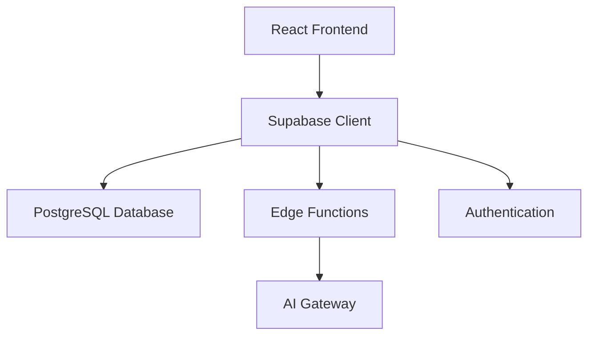

# OKR Strategy Planner

A full-stack web application that transforms business OKRs (Objectives and Key Results) into actionable implementation plans using AI-powered feature generation.

## Architecture Overview

This application follows a modern JAMstack architecture with a React frontend and Supabase backend, leveraging edge functions for AI integration.



## Tech Stack

### Frontend
- **React 18.3** - UI framework
- **TypeScript** - Type safety
- **Vite** - Build tool and dev server
- **Tailwind CSS** - Utility-first styling
- **shadcn/ui** - Component library
- **React Router** - Client-side routing
- **TanStack Query** - Server state management
- **React Hook Form + Zod** - Form validation

### Backend
- **Supabase** - Backend-as-a-Service
  - PostgreSQL database with Row Level Security (RLS)
  - Authentication (email/password)
  - Edge Functions (Deno runtime)
- **AI Gateway** - AI model integration for content generation

## Database Schema

### Tables

**profiles**
```sql
- id: UUID (PK, references auth.users)
- email: TEXT
- full_name: TEXT
- created_at: TIMESTAMP
- updated_at: TIMESTAMP
```

**strategies**
```sql
- id: UUID (PK)
- user_id: UUID (FK to auth.users)
- okr_text: TEXT
- product_type: TEXT
- created_at: TIMESTAMP
- updated_at: TIMESTAMP
```

**features**
```sql
- id: UUID (PK)
- strategy_id: UUID (FK to strategies)
- title: TEXT
- description: TEXT
- priority: TEXT
- estimated_time: TEXT
- created_at: TIMESTAMP
```

**kpis**
```sql
- id: UUID (PK)
- feature_id: UUID (FK to features)
- name: TEXT
- target: TEXT
- measurement: TEXT
- created_at: TIMESTAMP
```

**implementations**
```sql
- id: UUID (PK)
- strategy_id: UUID (FK to strategies)
- phases: JSONB
- total_weeks: INTEGER
- created_at: TIMESTAMP
```

### RLS Policies

All tables implement Row Level Security:
- Users can only read/write their own data
- Cascading permissions through foreign keys
- Profile creation automated via trigger on user signup

## Edge Functions

### generate-features
**Purpose**: AI-powered content generation for features, KPIs, and implementation plans

**Endpoint**: `/functions/v1/generate-features`

**Request Body**:
```typescript
{
  prompt: string;  // User's OKR + software context
  type: 'features' | 'kpis' | 'implementation';
}
```

**Response**: Structured JSON based on type

**Configuration**: 
- JWT verification disabled (public endpoint)
- Uses LOVABLE_API_KEY for AI Gateway authentication

### create-demo-user
**Purpose**: Development helper for creating test users

**Configuration**: JWT verification disabled

## Development Setup

### Prerequisites
- Node.js 18+ (recommended: use [nvm](https://github.com/nvm-sh/nvm))
- npm or yarn
- Supabase CLI (optional, for local development)

### Installation

```bash
# Clone repository
git clone <repository-url>
cd <project-directory>

# Install dependencies
npm install

# Start development server
npm run dev
```

The application will be available at `http://localhost:8080`

### Environment Variables

Required secrets (configured in Supabase):
- `LOVABLE_API_KEY` - AI Gateway API key
- `SUPABASE_URL` - Supabase project URL
- `SUPABASE_ANON_KEY` - Supabase anonymous key
- `SUPABASE_SERVICE_ROLE_KEY` - Supabase service role key

### Project Structure

```
src/
├── components/          # React components
│   ├── ui/             # shadcn/ui components
│   ├── OKRInput.tsx    # Step 1: OKR entry
│   ├── FeatureSelection.tsx  # Step 2: Feature selection
│   ├── KPISelection.tsx      # Step 3: KPI selection
│   └── ImplementationPlan.tsx # Step 4: Plan generation
├── hooks/              # Custom React hooks
│   └── useAuth.tsx     # Authentication hook
├── lib/                # Utility functions
│   ├── validation.ts   # Zod schemas
│   ├── exportUtils.ts  # PDF export
│   └── testAI.ts       # AI connection testing
├── pages/              # Route pages
│   ├── Index.tsx       # Main application
│   ├── Auth.tsx        # Login/signup
│   └── NotFound.tsx    # 404 page
├── services/           # API services
│   └── database.ts     # Supabase operations
└── integrations/       # Third-party integrations
    └── supabase/       # Supabase client & types

supabase/
├── functions/          # Edge functions
│   ├── generate-features/
│   └── create-demo-user/
└── config.toml         # Supabase configuration
```

## Key Features

### 1. OKR Input
- User enters business objective with software context
- Sample OKRs for quick testing (BillEaze, e-Tswane, eJoburg)
- Validation requires both OKR and software context

### 2. AI-Powered Feature Generation
- Generates 3-5 relevant features based on OKR
- Each feature includes:
  - Title and description
  - Priority level (High/Medium/Low)
  - Estimated implementation time
  - Dependencies
- User selects features to develop

### 3. KPI Selection
- Generates measurable KPIs for selected features
- Includes target values and measurement methods
- User selects KPIs to track

### 4. Implementation Planning
- Multi-phase development plan
- Week-by-week breakdown
- Dependencies and milestones
- Export to PDF functionality

## API Integration

### AI Generation Flow

```typescript
// Client-side invocation
const { data, error } = await supabase.functions.invoke('generate-features', {
  body: { 
    prompt: `${okrText}\n\nSoftware Context: ${softwareContext}`,
    type: 'features' 
  }
});

// Edge function processes via AI Gateway
const response = await fetch('https://ai.gateway.lovable.dev/v1/chat/completions', {
  method: 'POST',
  headers: {
    'Authorization': `Bearer ${apiKey}`,
    'Content-Type': 'application/json',
  },
  body: JSON.stringify({
    model: 'gpt-4o-mini',
    messages: [
      { role: 'system', content: systemPrompt },
      { role: 'user', content: prompt }
    ],
    tools: [toolDefinition]
  })
});
```

## Authentication

Implements Supabase Auth with:
- Email/password authentication
- Session persistence (localStorage)
- Auto-refresh tokens
- Protected routes
- Automatic profile creation on signup

## Deployment

### Lovable Platform
```bash
# Click "Publish" button in Lovable editor
# Automatic deployment to lovable.app subdomain
```

### Custom Deployment
```bash
# Build for production
npm run build

# Output in dist/ directory
# Deploy to any static hosting (Vercel, Netlify, etc.)
```

### Environment Configuration
- Supabase credentials configured in `src/integrations/supabase/client.ts`
- Edge function secrets managed via Supabase dashboard

## Development Workflow

1. **Local Development**: Use `npm run dev` with hot reload
2. **Database Changes**: Use Supabase migrations (auto-generated)
3. **Edge Functions**: Auto-deployed on code push
4. **Type Safety**: TypeScript types auto-generated from database schema

## Testing

### Manual Testing
- Use sample OKRs for quick testing
- Test AI connection: `src/lib/testAI.ts`

### Production Testing
- Monitor edge function logs in Supabase dashboard
- Check database queries in SQL editor
- Review authentication logs

## Performance Considerations

- React Query caching for API responses
- Lazy loading for route components
- Optimized Tailwind CSS (production builds)
- Edge function cold start ~100-500ms
- Database queries optimized with indexes

## Security

- Row Level Security (RLS) enabled on all tables
- JWT-based authentication
- API keys stored as Supabase secrets
- User data isolation via RLS policies
- Input validation with Zod schemas

## Troubleshooting

### Common Issues

**AI Generation Fails**
- Check LOVABLE_API_KEY is configured
- Review edge function logs
- Verify network connectivity

**Authentication Issues**
- Clear localStorage
- Check Supabase Auth providers enabled
- Verify email confirmation settings

**Database Errors**
- Check RLS policies
- Verify user authentication
- Review migration status

## Contributing

This project uses:
- ESLint for code linting
- TypeScript strict mode
- Prettier (recommended)
- Conventional commits (recommended)

## License

[Your License Here]

## Links

- **Lovable Project**: https://lovable.dev/projects/9d5a6491-efe3-4f07-ba59-1f789dba1eb9
- **Supabase Dashboard**: https://supabase.com/dashboard/project/wctoouoaxbokkzhrvkhm
